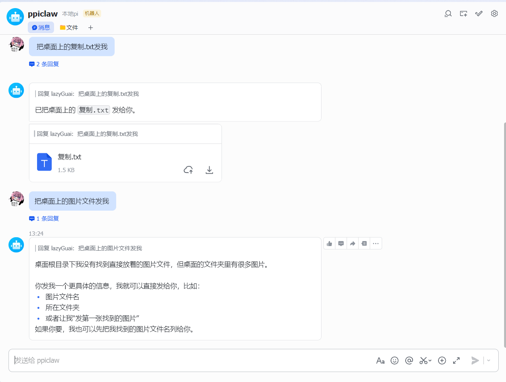
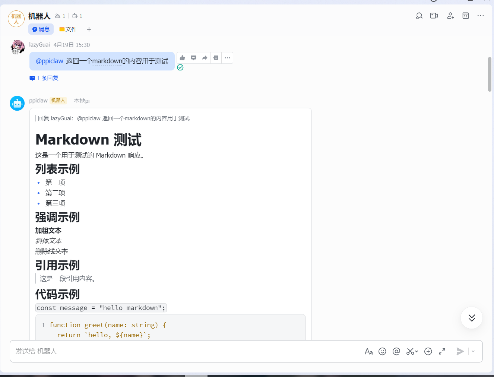

# Pi Mono + Feishu Bot（ppiclaw）

本项目基于 `pi-mono` 代码构建，目标是将 Pi 的 Coding Agent 能力接入飞书机器人，支持私聊/群聊问答、卡片展示、流式回复与文件发送等能力。

## 项目包含什么

- 保留 `pi-mono` 的多模型、会话、skills、工具调用能力
- 新增 `packages/feishu` 飞书接入层
- 支持飞书长连接收消息与自动回复
- 支持卡片 Markdown 展示
- 支持 `typing/thinking` 占位与最终内容替换
- 支持 `<send_file ... />` 指令发送本地文件

## 目录说明（重点）

- `packages/ai`：模型与流式能力
- `packages/agent`：Agent 运行时
- `packages/coding-agent`：Pi Coding Agent
- `packages/feishu`：飞书机器人接入与业务逻辑
- `config-templates`：本地配置模板（不含真实密钥）
- `scripts/init-agent-config.ps1`：Windows 一键初始化 `~/.pi/agent` 配置

## 快速开始（Windows）

1. 安装依赖

```powershell
npm install
```

2. 初始化本地配置（会生成 `~/.pi/agent/*.json`）

```powershell
powershell -ExecutionPolicy Bypass -File .\scripts\init-agent-config.ps1
```

3. 填写本地配置

- `~/.pi/agent/auth.json`：模型 API Key
- `~/.pi/agent/channels.json`：飞书 `appId`、`appSecret`、`botOpenId` 等

4. 启动飞书 Bot（按你本地启动方式）

默认入口为 `packages/feishu/dist/main.js`。

## 飞书功能说明

### 1) 会话与触发

- 私聊：默认直接触发
- 群聊：可通过 `requireMention` 控制是否必须 `@机器人`
- 线程消息：按“群 + 话题(thread)”维度隔离上下文

### 2) 回复形态

- 卡片 Markdown 显示
- 流式更新（stream replace）
- typing / thinking 占位与最终答案替换

### 3) 文件发送

机器人支持通过协议行触发发送：

```text
<send_file path="C:\path\to\file.ext" title="file.ext" />
```

会校验路径存在性与安全范围；路径无效或无权限时返回失败提示，不会误报“已发送”。

## 配置来源

项目运行配置以本地 `~/.pi/agent` 为主，不建议在源码中硬编码密钥。

主要文件：

- `auth.json`：模型认证
- `channels.json`：渠道配置（含 feishu）
- `settings.json` / `models.json`：默认模型与行为

建议先用 `config-templates/*.example` 复制生成，再填写真实值。

## 演示




