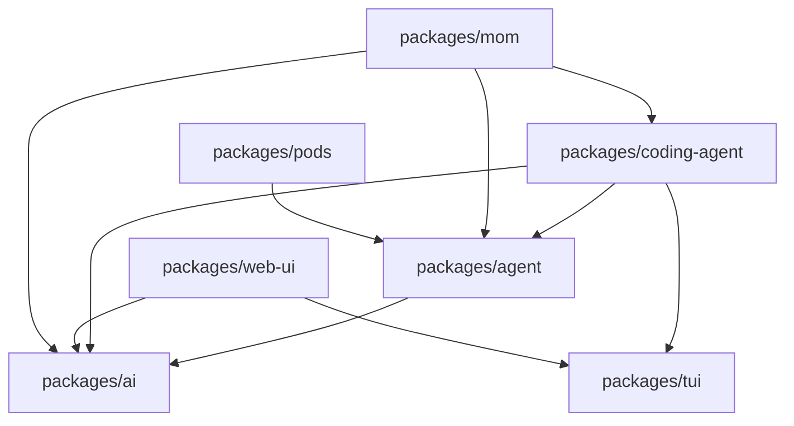

# pi-mono 代码结构分析

## 1. 仓库定位

`pi-mono` 是一个以 TypeScript 为主的 **Node.js Monorepo**，目标不是只做一个 CLI，而是围绕 “LLM 模型接入 + Agent 运行时 + 编码代理 + 终端/网页 UI + Slack/Pod 周边工具” 构建一整套可复用基础设施。

从根目录可以把它理解成 3 层：

1. **基础能力层**
   - `packages/ai`
   - `packages/agent`
   - `packages/tui`
2. **产品层**
   - `packages/coding-agent`
   - `packages/web-ui`
3. **集成/运维层**
   - `packages/mom`
   - `packages/pods`

其中真正的核心是：

- `packages/ai`：统一封装各 LLM Provider
- `packages/agent`：抽象 agent loop、消息、工具调用
- `packages/coding-agent`：把前两者变成完整的代码代理产品

根目录 `README.md` 里列出的主产品也是围绕这几个包展开。

---

## 2. 顶层目录结构

```text
pi-mono/
|- .github/                 CI、PR gate、贡献者审批、OSS weekend 自动化
|- .husky/                  Git pre-commit 钩子
|- .pi/                     项目级 pi 配置资源
|- packages/                所有工作区包
|- scripts/                 根级辅助脚本（发布、版本同步、profiling、browser smoke 等）
|- package.json             workspace 定义与根脚本
|- tsconfig.base.json       全仓共享 TS 编译配置
|- biome.json               lint/format 规则
|- test.sh / pi-test.sh     根级测试与本地运行脚本
```

几个顶层文件的职责很清晰：

- `package.json`
  - 使用 npm workspaces 管理多包。
  - 根级 `build` 按顺序构建：`tui -> ai -> agent -> coding-agent -> mom -> web-ui -> pods`。
  - 根级 `check` 先跑 `biome` 和 `tsgo --noEmit`，再跑浏览器 smoke check，最后进入 `packages/web-ui` 做额外检查。
- `tsconfig.base.json`
  - 统一使用 `ES2022`、`Node16` 模块解析、严格模式。
  - 开启声明文件输出、源码映射、装饰器支持。
- `biome.json`
  - 负责格式化和静态检查。
  - 只覆盖主要源码、测试、示例目录，排除了 `models.generated.ts`、`test-sessions.ts` 等生成/大文件。
- `.github/workflows/ci.yml`
  - CI 使用 Node 22。
  - 安装 `fd`、`ripgrep`、`canvas` 所需系统依赖。
  - 执行顺序：`npm ci -> npm run build -> npm run check -> npm test`。
- `.husky/pre-commit`
  - 提交前执行 `npm run check`。
  - 若改动了 `packages/ai`、`packages/web-ui`、`package.json`、`package-lock.json`，额外执行 browser smoke check。

---

## 3. Workspace 与依赖关系

根 `package.json` 声明了主工作区以及若干 example 子工作区，说明这个仓库不只是开发库，也把示例工程一并纳入构建体系。

核心包依赖关系可以概括为：



从这个关系可以看出：

- `ai` 是最底层的模型/Provider 抽象。
- `agent` 只关心“消息-工具-循环”，把底层模型调用交给 `ai`。
- `coding-agent` 是整个仓库最复杂的“装配层”，把模型、agent、session、tool、extension、TUI、RPC 串起来。
- `web-ui` 与 `coding-agent` 并不是简单上下级关系，而是共享 `ai` / `agent` / `tui` 的思路做网页端界面。
- `mom` 和 `pods` 属于把已有能力投递到 Slack、远程 GPU Pod 等具体场景。

---

## 4. 各包详细说明

## 4.1 `packages/ai`

### 定位

这是统一 LLM 接入层，目标是把不同 Provider 的调用方式、消息协议、流式事件、工具调用细节、OAuth/API Key 配置统一成一个公共接口。

### 目录结构

```text
packages/ai/
|- src/
|  |- providers/           各家 provider 实现
|  |- utils/               事件流、验证、overflow、oauth 辅助
|  |- api-registry.ts      Provider 注册中心
|  |- models.generated.ts  大型模型清单生成文件
|  |- models.ts            模型定义与查询
|  |- stream.ts            流式调用抽象
|  |- types.ts             全局类型定义
|  |- index.ts             包导出入口
|- scripts/
|  |- generate-models.ts   生成模型清单
|- test/                   大量 provider/stream/edge case 测试
```

### 关键设计

- `src/index.ts`
  - 只做聚合导出，向外暴露 models、provider options、stream、types、oauth 等。
- `src/providers/register-builtins.ts`
  - 这是理解 `ai` 包的关键文件之一。
  - 内建 provider 并不是一次性全部静态加载，而是通过 `import()` 懒加载。
  - 好处：
    - 减少初始加载体积。
    - 避免无关 provider 的依赖在运行开始时全部进入内存。
    - Provider 加载失败时，可以退化成标准错误消息，而不是整个程序直接崩掉。
- `src/models.generated.ts`
  - 体积很大，说明仓库把“已知模型元数据”当成一等公民维护。
  - `scripts/generate-models.ts` 负责生成它。
- `src/api-registry.ts`
  - 负责 provider 注册/查询，是 provider 机制的路由层。
- `src/types.ts`
  - 定义 `Model`、`Context`、`AssistantMessageEvent`、`StreamFunction` 等核心协议。

### Provider 分层

`providers/` 目录下基本按厂商拆分：

- `anthropic.ts`
- `amazon-bedrock.ts`
- `google.ts`
- `google-gemini-cli.ts`
- `google-vertex.ts`
- `mistral.ts`
- `openai-completions.ts`
- `openai-responses.ts`
- `openai-codex-responses.ts`
- `azure-openai-responses.ts`

还有一些共享/辅助文件：

- `openai-responses-shared.ts`
- `google-shared.ts`
- `transform-messages.ts`
- `simple-options.ts`

这说明作者不是把所有 provider 强塞进一个统一实现，而是：

1. 保持每个 provider 的独立调用逻辑。
2. 再通过统一类型层做“对外一致”。

### 测试特点

- `src` 约 43 个文件。
- `test` 约 49 个文件。
- 测试密度很高，覆盖：
  - 流式输出
  - tool call 正规化
  - reasoning/thinking 行为
  - context overflow
  - image tool result
  - OAuth
  - 各 provider 差异

这说明 `ai` 包是整个项目里最基础也最容易出兼容性问题的一层，因此测试很重。

---

## 4.2 `packages/agent`

### 定位

这是一个更“纯粹”的 agent runtime 包。它不关心 TUI，也不直接关心会话文件管理，只关心：

- 当前上下文是什么
- 什么时候向模型发请求
- assistant 返回 tool call 后如何执行工具
- tool result 再如何反馈回模型
- 整个 agent loop 如何继续或停止

### 目录结构

```text
packages/agent/
|- src/
|  |- agent-loop.ts
|  |- agent.ts
|  |- proxy.ts
|  |- types.ts
|  |- index.ts
|- test/
```

### 关键文件

- `src/agent-loop.ts`
  - 仓库里最值得读的核心循环之一。
  - 暴露：
    - `agentLoop(...)`
    - `agentLoopContinue(...)`
    - `runAgentLoop(...)`
    - `runAgentLoopContinue(...)`
  - 逻辑是双层循环：
    - 外层处理 follow-up message
    - 内层处理 tool call 和 steering message
  - 在真正请求模型前，才把内部 `AgentMessage[]` 转成 LLM 兼容消息，这是一个很好的边界设计。
- `src/agent.ts`
  - 提供状态化 `Agent` 类。
  - 管理：
    - transcript
    - event 订阅
    - steering/follow-up 队列
    - tool 执行前后 hook
    - sessionId、thinkingBudgets、transport 等运行参数
  - 可以理解为对低层 `agent-loop` 的“面向产品使用”的封装。
- `src/types.ts`
  - 定义 Agent 级别的事件和消息类型。

### 设计评价

`agent` 包的结构非常克制：

- 文件少
- 职责集中
- 重点在 runtime 行为而不是 UI/持久化

这使它更像一个可以被多个上层产品复用的“中间引擎”。

---

## 4.3 `packages/tui`

### 定位

这是一个终端 UI 库，而不是单纯给 `pi` 自己写死的界面。它实现了：

- 文本输入/编辑
- markdown 渲染
- 选择器
- 键盘事件解析
- 终端图片渲染
- 差分刷新

### 目录结构

```text
packages/tui/
|- src/
|  |- components/          基础 UI 组件
|  |- tui.ts               容器、组件树、overlay 等核心实现
|  |- terminal.ts          终端抽象
|  |- keys.ts              键盘解析
|  |- keybindings.ts       快捷键管理
|  |- terminal-image.ts    Kitty/iTerm 图片输出
|  |- autocomplete.ts      补全
|  |- index.ts             对外导出
|- test/
```

### 关键点

- `src/index.ts`
  - 聚合导出所有组件、键盘、终端、工具函数。
- `src/tui.ts`
  - 是框架核心，负责组件树、容器、聚焦、overlay、渲染。
- `src/components/editor.ts`
  - 文件体积很大，说明编辑器能力比较强。
- `src/terminal-image.ts`
  - 终端图片支持单独抽出来，说明作者非常在意多终端能力兼容。

### 测试特点

- `src` 约 25 个文件。
- `test` 约 27 个文件。
- 编辑器、键位、markdown、图片渲染、overlay 都有单测。

这说明 `tui` 不是“为了 pi 临时写的 UI 层”，而是一个相对独立的终端组件库。

---

## 4.4 `packages/coding-agent`

### 定位

这是整个仓库最核心、最复杂、产品化程度最高的包。它将：

- `pi-ai`
- `pi-agent-core`
- `pi-tui`
- session 持久化
- 工具系统
- extension system
- 技能/提示词/主题/资源发现
- 交互模式 / print 模式 / RPC 模式

拼装成一个完整的 coding agent。

### 目录结构

```text
packages/coding-agent/
|- docs/                   使用文档、扩展文档、RPC/SDK/主题/技能说明
|- examples/               扩展示例与 SDK 示例
|- scripts/
|- src/
|  |- cli/                 命令行参数、初始化输入、模型列表、session 选择
|  |- core/                真正的业务核心
|  |  |- compaction/       会话压缩与摘要
|  |  |- export-html/      会话导出为 HTML
|  |  |- extensions/       插件/扩展加载与运行
|  |  |- tools/            read/bash/edit/write/find/grep/ls
|  |  |- agent-session.ts
|  |  |- session-manager.ts
|  |  |- settings-manager.ts
|  |  |- resource-loader.ts
|  |  |- model-registry.ts
|  |  |- sdk.ts
|  |- modes/
|  |  |- interactive/      终端交互模式
|  |  |- rpc/              JSON stdin/stdout 协议
|  |  |- print-mode.ts
|  |- utils/
|  |- main.ts              CLI 主入口
|  |- index.ts             SDK 对外入口
|- test/
```

### 为什么它是核心

因为它同时承担了两个角色：

1. **最终产品**
   - CLI 就在这里启动。
2. **开发平台**
   - SDK、extension、skills、prompt templates、themes 也在这里暴露。

### 关键子系统拆解

#### A. CLI 启动层

- `src/main.ts`
  - 真正的 CLI 主入口。
  - 负责：
    - 解析参数
    - 决定运行模式：`interactive` / `print` / `json` / `rpc`
    - 读取 stdin / 文件参数
    - 选择 session
    - 初始化 settings、model、runtime
    - 把运行时交给不同模式执行

这一层本质上是“装配入口”，不是核心业务逻辑本身。

#### B. SDK 与运行时装配

- `src/index.ts`
  - 对外导出大量公共 API。
  - 说明 `coding-agent` 不只是一个 CLI，也是可嵌入的 SDK。
- `src/core/sdk.ts`
  - `createAgentSession(...)` 是最关键的工厂函数之一。
  - 负责组装：
    - `AuthStorage`
    - `ModelRegistry`
    - `SettingsManager`
    - `SessionManager`
    - `DefaultResourceLoader`
    - `AgentSession`
  - 这里非常像应用级依赖注入入口。
- `src/core/agent-session-services.ts`
  - 进一步把“cwd 相关的服务”打包起来。
  - 这样当 session 切换到新的 cwd 时，可以重建一套对应服务，而不是把所有全局对象写死。
- `src/core/agent-session-runtime.ts`
  - 管理当前 `AgentSession + Services`。
  - 负责：
    - `switchSession`
    - `newSession`
    - `fork`
    - `importFromJsonl`
  - 也就是“运行时热切换”的承载层。

#### C. AgentSession：上层产品的真正中枢

- `src/core/agent-session.ts`
  - 文件顶部注释已经明确说明它是各模式共享的核心抽象。
  - 管理内容包括：
    - Agent 状态访问
    - session 自动持久化
    - model / thinking level 切换
    - compaction
    - bash 执行
    - session switching / branching
    - extension 绑定
  - 它相当于把 `pi-agent-core` 的纯 loop，升级成“可持久化、可扩展、可切换、可恢复”的产品级会话对象。

可以把它理解成：

`Agent` 是引擎；
`AgentSession` 是完整驾驶舱。

#### D. Session 持久化与分支

- `src/core/session-manager.ts`
  - 是另一个非常核心的文件。
  - 会话文件本质是 JSONL 风格的 entry 流。
  - 关键能力包括：
    - session header 管理
    - entry 类型定义
    - 版本迁移（当前版本是 3）
    - 构建 session context
    - 读取/列出/查找 session
    - 分支树结构
    - label / session info / custom entry
  - 这里可以看出作者把“对话”当成一棵树，而不是一条线。

它支持的 entry 类型不只有 message，还包括：

- `thinking_level_change`
- `model_change`
- `compaction`
- `branch_summary`
- `custom`
- `custom_message`
- `label`
- `session_info`

这套设计让会话文件既能作为恢复源，也能作为扩展状态容器。

#### E. 工具系统

- `src/core/tools/`
  - 内建工具分得很清楚：
    - `read.ts`
    - `bash.ts`
    - `edit.ts`
    - `write.ts`
    - `grep.ts`
    - `find.ts`
    - `ls.ts`
  - `index.ts` 定义了几组预设：
    - `codingTools = [read, bash, edit, write]`
    - `readOnlyTools = [read, grep, find, ls]`
    - `allTools`
  - 同时还能按 cwd 动态创建工具定义和工具实例。

这说明工具系统被设计成：

- 既能直接给 agent 使用
- 又能转成 extension 可感知的 tool definition

#### F. Extension System

- `src/core/extensions/loader.ts`
  - 是扩展系统的入口文件。
  - 使用 `@mariozechner/jiti` 动态加载 TypeScript 扩展。
  - 为 Bun 编译产物准备了 `virtualModules`，说明作者从一开始就考虑了“开发态 Node.js”和“编译后二进制”双运行环境。
- `src/core/extensions/runner.ts` / `types.ts`
  - 管理事件、工具注册、命令注册、flag、message renderer 等。

扩展系统支持注册的能力相当多：

- 事件处理器
- Tool
- Command
- Shortcut
- Flag
- Message renderer
- Provider

这意味着 `pi` 的可扩展性是架构主轴之一，不是附加功能。

#### G. Resource Loader

- `src/core/resource-loader.ts`
  - 把 skills、prompt templates、themes、extensions、`AGENTS.md`/`CLAUDE.md` 等上下文资源统一装载。
  - 它会：
    - 查找全局与项目级上下文文件
    - 加载扩展
    - 加载技能
    - 加载 prompt templates
    - 加载主题
    - 维护附加 system prompt

它的重要意义在于：把“运行逻辑”与“资源发现逻辑”解耦。

#### H. Model Registry

- `src/core/model-registry.ts`
  - 管理：
    - 内建 model/provider
    - 自定义 models.json
    - OAuth provider 注册
    - API key / headers 解析
    - provider 覆写
  - 使用 AJV + TypeBox 校验配置。
  - 这是 `coding-agent` 连接 `pi-ai` 和配置系统的关键桥梁。

#### I. 模式层

- `src/modes/interactive/interactive-mode.ts`
  - 文件体量极大，说明大部分产品交互复杂度在这里。
  - 它负责把 `AgentSession` 的事件和 `pi-tui` 组件连接起来。
- `src/modes/rpc/rpc-mode.ts`
  - 提供 JSON stdin/stdout 协议。
  - 适合嵌入其他宿主程序。
- `src/modes/print-mode.ts`
  - 更轻量，适合非交互输出。

#### J. 示例与文档

- `docs/` 内容很多，说明作者把包本身当平台在维护。
- `examples/extensions/` 里有大量扩展示例，几乎可以视作扩展 API 的活文档。
- `examples/sdk/` 则是 SDK 入门路径。

### 规模与复杂度

- `src` 约 138 个文件。
- `test` 约 121 个文件。
- 这是整个仓库明显最大的包。

如果你要理解整个项目，最值得优先读的包就是它。

---

## 4.5 `packages/web-ui`

### 定位

这是网页端 UI 组件库，用于构建 AI chat / agent 交互界面。技术路线不是 React，而是 `lit` + `mini-lit` 风格的 Web Components。

### 目录结构

```text
packages/web-ui/
|- src/
|  |- components/
|  |- dialogs/
|  |- prompts/
|  |- storage/
|  |- tools/
|  |- utils/
|  |- ChatPanel.ts
|  |- index.ts
|- example/               Vite 示例项目
```

### 关键点

- `src/index.ts`
  - 对外暴露大量 UI 组件、dialog、tool renderer、storage、sandbox runtime provider。
- `src/ChatPanel.ts`
  - 是很好的入口文件。
  - 负责把：
    - `Agent`
    - `AgentInterface`
    - `ArtifactsPanel`
    - runtime providers
    - tool renderer
    - 响应式布局
    串到一起。
- `src/components/`
  - 包含消息列表、输入框、provider key 输入、sandboxed iframe 等。
- `src/dialogs/`
  - 包含模型选择、附件预览、设置、session 列表等 UI。
- `src/storage/`
  - 有独立的 store/backends 抽象。
  - `stores/` 下可以看到：
    - `custom-providers-store.ts`
    - `provider-keys-store.ts`
    - `sessions-store.ts`
    - `settings-store.ts`
- `src/tools/renderers/`
  - 网页端单独为工具输出做 renderer：
    - `BashRenderer.ts`
    - `CalculateRenderer.ts`
    - `DefaultRenderer.ts`
    - `GetCurrentTimeRenderer.ts`

### 技术特点

- 使用 `lit` 的装饰器和 `customElement`。
- 通过 sandbox runtime provider 承载 artifact、附件、下载等能力。
- 与 `pi-agent-core` 的契合点较深，不只是“画聊天气泡”。

### 规模

- `src` 约 72 个文件。
- 自带 `example/`，便于单独调试。

---

## 4.6 `packages/mom`

### 定位

这是一个 Slack bot，把 Slack 消息转发给 coding agent 处理。可以把它理解为 “pi 的 Slack 托管层”。

### 目录结构

```text
packages/mom/
|- src/
|  |- main.ts
|  |- slack.ts
|  |- agent.ts
|  |- sandbox.ts
|  |- store.ts
|  |- tools/
```

### 关键点

- `src/main.ts`
  - CLI 入口。
  - 负责读取 Slack token、解析 sandbox 参数、按 channel 创建状态。
- `src/slack.ts`
  - 封装 Slack Socket Mode / Web API 通信。
- `src/agent.ts`
  - 应该负责把 Slack 消息转换成 agent 执行任务。
- `src/sandbox.ts`
  - 说明它支持宿主/容器等不同执行沙箱。
- `src/tools/`
  - 内置给 Slack 代理使用的 read/bash/edit/write/attach/truncate 等工具。

### 架构含义

`mom` 并没有重新发明 agent 逻辑，而是把 `coding-agent` 作为底座，自己关注：

- Slack 适配
- 文件下载/上传
- 渠道状态管理
- sandbox 控制

这是很标准的“适配器层”设计。

### 规模

- `src` 约 16 个文件。

---

## 4.7 `packages/pods`

### 定位

这是远程 GPU Pod / vLLM 部署管理工具，面向模型服务运维。

### 目录结构

```text
packages/pods/
|- src/
|  |- cli.ts
|  |- config.ts
|  |- ssh.ts
|  |- model-configs.ts
|  |- models.json
|  |- commands/
|     |- models.ts
|     |- pods.ts
|     |- prompt.ts
|- scripts/
|  |- pod_setup.sh
|  |- model_run.sh
```

### 关键点

- `src/cli.ts`
  - 命令行入口。
  - 支持：
    - `pi pods setup`
    - `pi pods active`
    - `pi shell`
    - `pi ssh`
    - `pi start/stop/list/logs`
    - `pi agent`
- `src/ssh.ts`
  - 负责远程命令执行。
- `scripts/pod_setup.sh`
  - 负责远程环境初始化。
- `src/models.json`
  - 维护模型预设。

### 架构含义

这个包不是通用 agent 产品，而是面向“远程模型部署”和“基于 Pod 的使用流”做的一层 CLI。

### 规模

- `src` 约 10 个文件。

---

## 5. 项目最重要的运行链路

如果按“用户启动 pi 后，内部发生了什么”来理解，主链路大概如下：

### 5.1 CLI 启动

`packages/coding-agent/src/main.ts`

1. 解析 CLI 参数。
2. 判断使用 interactive / print / json / rpc 模式。
3. 读取 stdin 或文件参数，拼装 initial message。
4. 创建或恢复 `SessionManager`。
5. 创建 session runtime。

### 5.2 运行时装配

`createAgentSessionServices(...)` +
`createAgentSession(...)`

1. 初始化 auth / settings / model registry / resource loader。
2. 发现扩展、技能、提示词、主题、上下文文件。
3. 按当前 cwd 绑定可用资源。
4. 找到初始模型与 thinking level。
5. 生成 `AgentSession`。

### 5.3 用户发起一轮对话

`AgentSession.prompt(...)`

1. 将输入转成用户消息。
2. 视情况扩展 prompt template、skill block、附件等。
3. 把消息写入 `Agent`。
4. 订阅 agent 事件并同步写入 session。

### 5.4 Agent Loop 执行

`packages/agent/src/agent-loop.ts`

1. 发送 `turn_start`。
2. 调用底层 LLM stream。
3. 收到 assistant message。
4. 若包含 tool call，则执行工具。
5. 把 tool result 再喂回模型。
6. 若有 steering/follow-up message，则继续下一轮。
7. 最终发出 `agent_end`。

### 5.5 持久化与压缩

`packages/coding-agent/src/core/session-manager.ts`
`packages/coding-agent/src/core/compaction/`

1. 每轮消息和状态变化写入 session entry。
2. 达到上下文阈值时进行 compaction。
3. 必要时生成 branch summary。
4. 在恢复时根据 session file 重建上下文、模型、thinking 状态。

### 5.6 UI 层消费

- 终端模式：`interactive-mode.ts` + `pi-tui`
- RPC 模式：`rpc-mode.ts`
- Web 模式：`pi-web-ui`
- Slack 模式：`mom`

也就是说，底层 agent/runtime 是一套，外层交互入口可以有多个。

---

## 6. 架构上的几个显著特点

### 6.1 “产品代码”和“平台代码”并存

很多仓库只有一种身份，要么是 CLI，要么是 SDK。`pi-mono` 同时具备两者：

- 直接可运行的产品：
  - `coding-agent`
  - `mom`
  - `pods`
- 可复用的平台层：
  - `ai`
  - `agent`
  - `tui`
  - `web-ui`

### 6.2 会话模型是树，不是线

`session-manager.ts` 的 `parentId`、branch summary、fork/session switch 说明：

- 作者从架构上支持会话分叉
- 不是简单追加聊天记录
- 更接近代码工作流中的“分支推演”

这对 coding agent 非常重要。

### 6.3 扩展系统是一级能力

从 `extensions/`、`examples/extensions/`、resource loader、flag/provider 注册可以看出：

- 扩展不是贴边功能
- 整个项目从运行时、UI、provider、tool、命令、消息渲染多个层面为扩展预留了挂点

### 6.4 资源发现机制非常系统

`resource-loader.ts` + `package-manager.ts` + `skills.ts` 说明项目对以下资源都做了统一发现：

- 扩展
- 技能
- 提示模板
- 主题
- `AGENTS.md` / `CLAUDE.md`

这意味着“上下文和行为配置”已经被视为和源码同等重要的资产。

### 6.5 测试覆盖非常重

按我在本地统计的大致数量：

- `packages/ai/test`: 49
- `packages/agent/test`: 5
- `packages/coding-agent/test`: 121
- `packages/tui/test`: 27

这说明仓库重心不是 demo，而是长期维护的复杂产品。

---

## 7. 推荐阅读顺序

如果你想真正读懂这个仓库，建议按下面顺序：

1. 根目录 `package.json`
   - 先搞清楚有哪些 workspace、构建顺序是什么。
2. `packages/ai/src/index.ts`
   - 再看 `providers/register-builtins.ts` 和 `types.ts`。
3. `packages/agent/src/agent.ts`
   - 再看 `agent-loop.ts`。
4. `packages/coding-agent/src/main.ts`
   - 先理解 CLI 是如何把参数转为 runtime 的。
5. `packages/coding-agent/src/core/sdk.ts`
   - 看清依赖如何装配。
6. `packages/coding-agent/src/core/agent-session.ts`
   - 这是产品级会话核心。
7. `packages/coding-agent/src/core/session-manager.ts`
   - 理解会话树和 JSONL 持久化。
8. `packages/coding-agent/src/core/extensions/loader.ts`
   - 理解扩展系统。
9. `packages/coding-agent/src/modes/interactive/interactive-mode.ts`
   - 最后看交互层。
10. `packages/web-ui/src/ChatPanel.ts`
   - 再去看 Web 版是怎么复用 agent 能力的。

---

## 8. 结论

`pi-mono` 不是一个“单命令工具仓库”，而是一个围绕 AI coding agent 构建的完整平台型 monorepo。它的技术重点不在某一个华丽算法，而在以下几件事情上做得非常扎实：

- 多 Provider 模型接入统一化
- agent loop 与工具调用的清晰分层
- 会话树、分支、压缩、恢复等长期状态管理
- 强扩展能力
- TUI / RPC / Web / Slack / Pod 多入口复用同一核心能力

如果只选一个包深入研究，优先看 `packages/coding-agent`；如果想理解底层抽象，优先看 `packages/ai + packages/agent`；如果想学习产品化终端代理如何落地，则把 `packages/coding-agent + packages/tui + packages/web-ui` 放在一起看最有价值。
