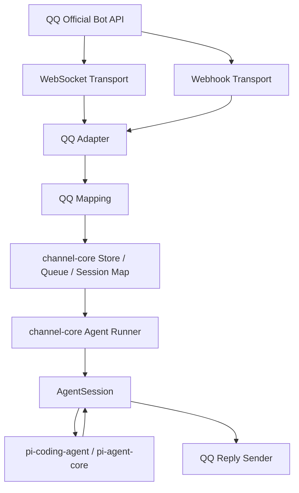
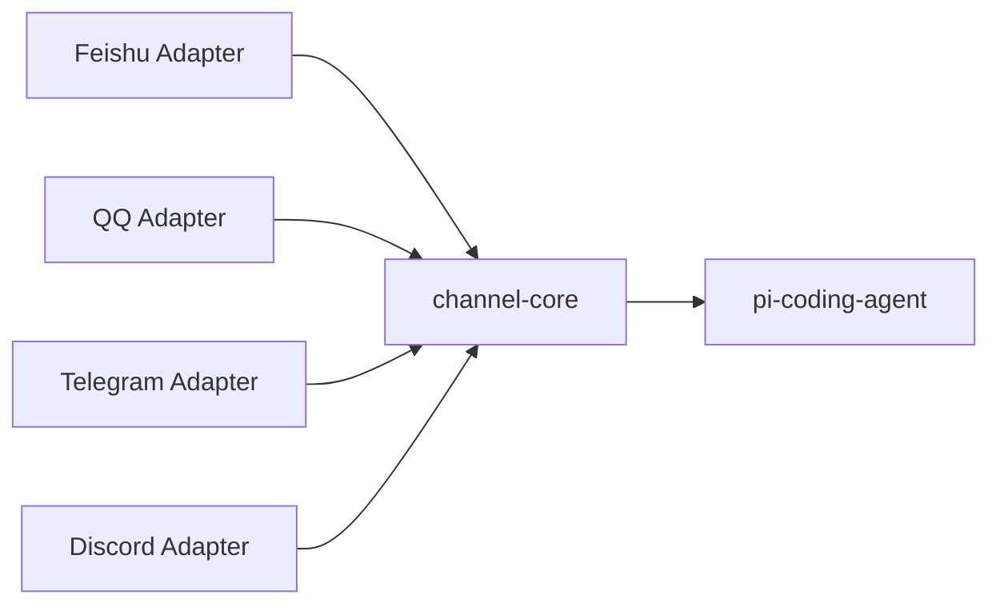

# pi-mono 学习与 QQ 官方 Bot API 升级方案

## 1. 目标

本方案的目标分成两条线，同时推进：

1. 学会 `pi-mono` 这个项目的核心结构和运行链路
2. 在尽量少破坏现有架构的前提下，为项目增加 **QQ 官方 Bot API** 接入能力

最终目标不是“硬塞一个 QQ 收发消息脚本”，而是做出一个：

- 能收 QQ 官方 Bot 消息
- 能把消息送进 `pi-coding-agent`
- 能保持会话上下文
- 能复用现有工具、记忆、session 能力
- 后续还能继续扩展图片、文件、群聊、权限控制

的正式接入层。

---

## 2. 升级后的核心结论

### 2.1 我们不直接改 `packages/coding-agent` 主体

原因：

- `packages/coding-agent` 是通用 agent 产品层
- QQ 接入本质上是“消息平台适配器”
- 现有仓库里已经有一个非常好的参考实现：`packages/mom`

但如果只是简单复制 `mom` 做成一个 `packages/qqbot`，当未来还要接飞书、Telegram、Discord、微信时，就会产生大量重复代码。

所以升级后的做法是：

> 参考 `packages/mom` 的平台适配思路，但不直接复制成单一 QQ 版本，而是先抽一个轻量 `channel-core`，再新增 `packages/qqbot` 作为第一个渠道实现

### 2.2 为什么要升级方案

原方案适合“只接一个 QQ 平台，先尽快跑通”。

但你已经明确说：

- 未来还可能接其他平台
- 希望后面继续接入时更方便

那方案就应该从：

> 单平台适配

升级成：

> 多平台可复用的轻量接入框架

注意，这里不是要现在就把项目改造成完整的 OpenClaw。

我们要做的是：

- 保留 `pi-mono` 的轻量风格
- 不碰 `pi-coding-agent` 主体
- 只提前抽出最小“平台无关层”

这样第一版仍然可以尽快落地 QQ，同时未来继续接其他平台也不会推倒重来。

---

## 3. OpenClaw 是怎么做的

根据 OpenClaw 当前官方公开信息，它的方向是：

- 用一个长期运行的 `Gateway` 统一管理渠道、会话、路由和状态
- 把不同聊天平台做成 `channel plugins`
- 把具体 Agent 后端作为可替换的能力层，而不是把渠道逻辑塞进 Agent 内核

也就是说，在 OpenClaw 的设计里：

> 平台接入层 和 Agent 核心层 是分开的

这给我们的启发不是“照搬 OpenClaw 的整套插件系统”，而是：

- 现在就把平台无关层抽出来
- 让 QQ 成为第一个渠道实现
- 等以后真要接第二个、第三个平台，再继续增强成更完整的插件化结构

换句话说：

> 我们先做“像 OpenClaw 一样的分层方向”，但不在第一阶段就复制 OpenClaw 的完整产品框架

---

## 4. 当前仓库里最值得复用的部分

## 4.1 `packages/coding-agent`

这是 agent 产品核心。

我们会复用：

- `AgentSession`
- `SessionManager`
- `SettingsManager`
- `AuthStorage`
- `ModelRegistry`
- tools / skills / prompts / context 机制

作用：

- 让 QQ 机器人拥有完整的 agent 对话能力
- 而不是只做一个“QQ 消息 -> 调一次 LLM -> 回复”的简单聊天机器人

## 4.2 `packages/mom`

这是现成的“Slack 平台适配层”。

它已经解决了这些关键问题：

- 消息平台事件接收
- 平台消息结构 -> agent 输入结构映射
- 每个频道独立会话
- 消息日志持久化
- 附件下载
- agent 运行中的停止、排队、回帖

对 QQ 接入来说，`mom` 是最佳模板。

## 4.3 `packages/agent`

这是更底层的 agent loop。

学习时要理解它，但做 QQ 接入时一般不直接改它。

---

## 5. QQ 官方 Bot API 的现状判断

这是本方案里最重要的风险点。

### 5.1 已确认信息

从 OpenClaw 文档可以确认：

- OpenClaw 的 QQ Bot 接入当前使用的是 **QQ Bot API**
- 文档描述为支持：
  - C2C 私聊
  - 群 `@` 消息
  - guild / channel 消息
  - 富媒体

### 5.2 官方链路存在一个需要注意的变化

腾讯官方 `botgo` 仓库 README 里明确写到：

- `websocket` 事件推送链路会逐步下线
- 新的 `webhook` 事件回调链路在灰度验证中
- 灰度期间，老机器人仍可使用 websocket 接收事件

这意味着：

> 我们不能把实现死绑在单一传输方式上

### 5.3 方案上的应对

我们的接入设计必须分两层：

1. **QQ 消息传输层**
   - 负责接收 QQ 平台事件
   - 可支持 WebSocket 或 Webhook

2. **QQ 平台适配层**
   - 负责把 QQ 事件转换成统一的内部消息结构
   - 与 `AgentSession` 对接

这样后面就算腾讯彻底切换链路，我们只改传输层，不动 agent 层。

---

## 6. 升级后的总体设计

## 6.1 新增包

升级后的方案不再是“只新增 `packages/qqbot`”，而是新增两层：

1. `packages/channel-core`
2. `packages/qqbot`

其中：

- `channel-core` 负责平台无关能力
- `qqbot` 只负责 QQ 官方 Bot API 接入

### 6.1.1 `packages/channel-core`

建议新增：

```text
packages/channel-core/
```

建议结构：

```text
packages/channel-core/
|- src/
|  |- types.ts
|  |- agent-runner.ts
|  |- session-map.ts
|  |- queue.ts
|  |- store.ts
|  |- attachments.ts
|  |- context.ts
|  |- index.ts
|- package.json
|- README.md
```

这一层只放平台无关的东西，例如：

- 统一消息类型
- 统一回复接口
- 会话键生成
- 通用排队机制
- 通用 AgentRunner
- 通用 store / log 接口

### 6.1.2 `packages/qqbot`

QQ 包只依赖 `channel-core`，负责 QQ 适配。

建议结构：

```text
packages/qqbot/
|- src/
|  |- main.ts
|  |- qq.ts
|  |- config.ts
|  |- mapping.ts
|  |- transport/
|  |  |- websocket.ts
|  |  |- webhook.ts
|- package.json
|- README.md
```

其中：

- `main.ts`
  - CLI 入口
- `qq.ts`
  - QQ 平台适配器主逻辑
- `config.ts`
  - 配置和环境变量解析
- `mapping.ts`
  - QQ 事件到 `channel-core` 统一消息结构的映射
- `transport/websocket.ts`
  - WebSocket 事件接收
- `transport/webhook.ts`
  - Webhook 回调接收

---

## 6.2 平台无关层设计

`channel-core` 至少要定义下面几类统一概念。

### 6.2.1 统一入站消息

例如：

```ts
interface IncomingMessage {
  platform: string;
  conversationKey: string;
  messageId: string;
  senderId: string;
  senderName?: string;
  text: string;
  isDirect: boolean;
  isMentioned: boolean;
  attachments: AttachmentRef[];
  rawEvent?: unknown;
}
```

### 6.2.2 统一回复接口

例如：

```ts
interface ReplyHandle {
  reply(text: string): Promise<void>;
  replace?(text: string): Promise<void>;
  replyInThread?(text: string): Promise<void>;
  uploadFile?(path: string, title?: string): Promise<void>;
  setWorking?(working: boolean): Promise<void>;
  delete?(): Promise<void>;
}
```

### 6.2.3 会话键

不同平台最终都要映射成统一的 `conversationKey`。

例如：

- QQ 私聊：`qq:dm:<userId>`
- QQ 群聊：`qq:group:<groupId>`
- 飞书私聊：`feishu:dm:<openId>`
- Telegram 私聊：`telegram:dm:<chatId>`

这样 session 管理层就不需要关心平台细节。

### 6.2.4 平台适配器接口

例如：

```ts
interface ChannelAdapter {
  start(): Promise<void>;
  stop(): Promise<void>;
}
```

每个平台只负责：

- 接收平台事件
- 映射成 `IncomingMessage`
- 调用 `channel-core` 的 runner
- 把结果再发回平台

---

## 6.3 架构图



再往后扩展其他平台时，结构就是：



---

## 7. 第一阶段范围

第一阶段我们仍然只做最小可用版，不追求一次把全部能力做齐。

### 7.1 支持范围

- QQ 官方 Bot API
- 单 Bot 账号
- 文本消息接收
- C2C 私聊
- 群聊中 `@bot`
- 基础文本回复
- 会话持久化
- 独立 session

### 7.2 暂不做

- 图片上传/下载
- 语音 STT/TTS
- 文件回传
- guild/channel 富媒体
- 多账号
- 权限白名单
- 群策略（只在 mention 时回复、静默模式等）
- 指令系统（如 `/bot-help`）

先把最小链路跑通，再逐步升级。

---

## 8. 学习路线

为了避免一边写接入一边看不懂仓库，我们先按最小学习路径走。

## 第 1 步：理解仓库分层

先看：

- 根目录 `README.md`
- 根目录 `package.json`
- `PI_MONO_零基础学习指南.md`

目标：

- 知道整个 monorepo 里哪些包是基础层，哪些是产品层

## 第 2 步：理解 `pi-coding-agent` 怎么启动

重点看：

- `packages/coding-agent/src/main.ts`
- `packages/coding-agent/docs/sdk.md`

目标：

- 知道如何把 session 嵌进别的应用

## 第 3 步：理解 `mom`

重点看：

- `packages/mom/src/main.ts`
- `packages/mom/src/slack.ts`
- `packages/mom/src/agent.ts`
- `packages/mom/src/store.ts`

目标：

- 搞懂“平台消息 -> agent session”的适配方式

## 第 4 步：开始做 `channel-core + qqbot`

先抽最小公共层，再做 QQ。

原因：

- 未来扩展性明显更好
- 额外复杂度仍然可控
- 不会一上来就做成重型插件系统

---

## 9. 开发阶段拆分

## 阶段 A：方案与准备

输出：

- 本 `方案.md`
- 确认 QQ 官方 Bot API 选择
- 确认最小范围

完成标准：

- 方案写清楚
- 明确优先做文本消息链路

## 阶段 B：脚手架搭建

任务：

- 新建 `packages/channel-core`
- 新建 `packages/qqbot`
- 初始化 `package.json`
- 建立 `src/` 目录
- 先让 `qqbot --help` 能跑

完成标准：

- 包可以安装依赖
- TypeScript 入口可编译 / 可运行

## 阶段 C：抽出平台无关逻辑

任务：

- 参考 `mom` 的 agent runner
- 把和 Slack 强耦合的上下文接口改成更中性的 `IncomingMessage + ReplyHandle`
- 在 `channel-core` 中沉淀通用 queue / session / store 能力

完成标准：

- `channel-core` 中的 AgentRunner 不再依赖 Slack 或 QQ 专有类型

说明：

这一步是本次方案升级的关键。

但我们仍然坚持“只抽最小公共层”，不提前做完整插件框架。

## 阶段 D：QQ 事件接收

任务：

- 接入 QQ 官方 Bot API
- 先打通一种事件接收方式
- 收到消息后能打印到本地日志

完成标准：

- 本地能看到 QQ 发来的消息事件

## 阶段 E：QQ -> channel-core -> AgentSession

任务：

- 把 QQ 消息转换成统一内部消息
- 建立用户/群聊到 session 的映射
- 通过 `channel-core` 调用 `session.prompt()`

完成标准：

- 机器人能基于 `pi-coding-agent` 返回文本结果

## 阶段 F：回复发送

任务：

- 把 agent 最终文本发回 QQ
- 处理超长文本截断
- 处理运行中提示

完成标准：

- 完成一个闭环：
  - QQ 发消息
  - 本地 agent 推理
  - QQ 收到回复

## 阶段 G：持久化与稳定性

任务：

- 落日志
- 落会话
- 处理并发与排队
- 重连与 token 刷新

完成标准：

- 进程重启后仍能恢复主要上下文

## 阶段 H：升级能力

后续再做：

- 图片
- 文件
- 群策略
- 白名单
- slash 指令
- 多账号
- transport 抽象切换

---

## 10. 推荐实现策略

## 10.1 第一版先“轻量公共层 + 单渠道实现”，不要先“完整插件系统”

具体建议：

- 先抽一个最小 `channel-core`
- 再做第一个渠道 `qqbot`
- 不要第一步就重构成 OpenClaw 式完整插件系统
- 先让功能跑起来

原因：

- 你现在的目标是学习 + 升级
- 不是先做一个理论上最完整的大框架

## 10.2 等 QQ 跑通后，再决定是否继续插件化

如果后面真的要接第二个、第三个平台，再继续升级：

- channel registration
- adapter discovery
- transport factory
- plugin manifest
- 动态装载

也就是说：

我们先做到“像 OpenClaw 一样的分层方向”，
但不在第一阶段就复制 OpenClaw 的完整插件系统。

---

## 11. 风险与难点

## 11.1 官方传输链路变化

这是最大风险。

风险：

- WebSocket 旧链路可能被继续弱化
- Webhook 新链路可能需要灰度资格

应对：

- 传输层单独封装
- 不把业务逻辑写死在传输层

## 11.2 QQ 平台权限和限制

可能遇到：

- 机器人未通过审核
- 沙箱成员限制
- IP 白名单限制
- 主动消息限制

应对：

- 第一版优先做“用户先发消息 -> bot 回复”
- 不依赖主动推送能力

## 11.3 富媒体复杂度高

图片、语音、文件、群频道消息格式可能不同。

应对：

- 第一阶段只做文本

## 11.4 与 `mom` 的耦合较深

`mom` 当前代码里 Slack 类型直接进入了 agent runner。

升级后应对：

- 允许参考 `mom`
- 但第一版就把最小公共接口抽到 `channel-core`

---

## 12. 第一阶段完成标准

只要达到下面这些，就算第一阶段成功：

- 项目里新增 `packages/channel-core`
- 项目里新增 `packages/qqbot`
- 能配置 QQ 官方 Bot AppID / Secret
- 能接收私聊文本
- 能在群里通过 `@bot` 触发
- 能调用 `pi-coding-agent` 完成回复
- 能把回复发回 QQ
- 每个聊天对象有独立 session

---

## 13. 建议的实现顺序

下一步实际开发时，严格按这个顺序走：

1. 建 `packages/channel-core` 脚手架
2. 建 `packages/qqbot` 脚手架
3. 定义统一 `types.ts`
4. 写最小 `config.ts`
5. 接通 QQ 事件接收
6. 收到消息先只打印日志
7. 接入 `channel-core AgentRunner`
8. 发回纯文本消息
9. 做 session 持久化
10. 做群聊 `@` 过滤
11. 再处理图片和文件

---

## 14. 我们接下来怎么执行

从下一步开始，按下面节奏推进：

### 第一步

创建 `packages/channel-core` 和 `packages/qqbot` 的最小脚手架。

### 第二步

把 `mom` 里最关键的通用逻辑迁移到 `channel-core`，再让 QQ 版本接入。

### 第三步

先打通“收消息 -> 打日志 -> 回固定文本”。

### 第四步

接入 `AgentSession`。

### 第五步

做成真正的 QQ Agent Bot。

---

## 15. 当前结论

本项目升级接入 QQ 官方 Bot API 是可行的。

最合理的路线不是改 `pi-coding-agent` 主体，而是：

> 先抽一个轻量 `packages/channel-core`，再新增 `packages/qqbot` 作为第一个平台接入层

并且为了适应 QQ 官方链路变化，必须把“消息传输层”和“平台适配层”拆开设计。

如果未来还要继续接入其他平台，这个方案会比“直接复制 `mom`”明显更方便。

第一阶段我们只做：

- 文本
- 单 Bot
- 私聊 + 群 `@`
- 持久 session

先跑通，再升级。
