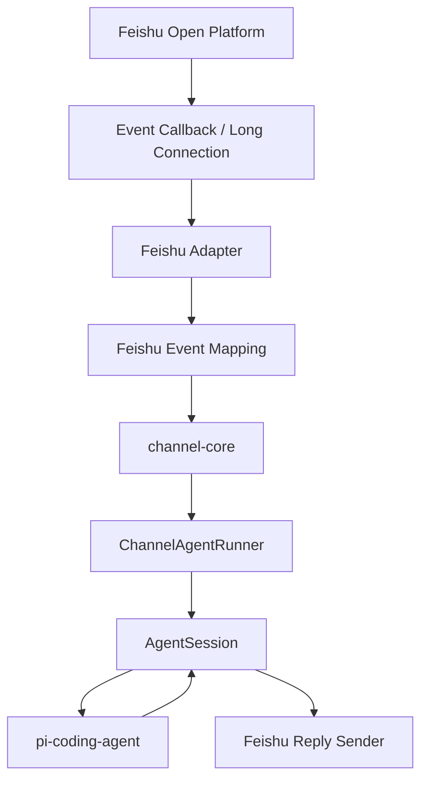

# pi-mono 飞书接入方案

## 1. 目标

这份方案的目标不是马上开写飞书代码，而是先把下面三件事讲清楚：

1. 为什么飞书值得作为下一个接入平台
2. 现有 `pi-mono` 架构里，哪些部分可以直接复用
3. 飞书接入应该按什么顺序落地，才能尽快跑通最小闭环

这份方案确认后，我们再进入编码阶段。

---

## 2. 当前背景

项目里已经开始形成一条更可复用的接入思路：

- `packages/channel-core`
  - 平台无关层
  - 负责统一消息结构、回复接口、队列、会话目录、日志等
- `packages/qqbot`
  - 第一个具体渠道实现
  - 负责 QQ 平台消息映射、配置、传输层和回复

这意味着：

> 飞书不应该再从零写一套“平台消息 -> agent -> 回复”的逻辑，
> 而应该作为第二个渠道实现，复用 `channel-core`

所以飞书方案的核心不是“再复制一个 `mom` 或 `qqbot`”，而是：

> 新增 `packages/feishu`，作为基于 `channel-core` 的第二个平台适配器

---

## 3. 为什么先做飞书

相比你现在遇到的 QQ 现状，飞书更适合先作为第二个平台跑通。

### 3.1 后台入口更明确

根据当前飞书官方资料，飞书自建应用有明确的：

- 事件与回调
- 请求地址
- 权限配置
- 事件订阅

这比 QQ 当前“入口灰度、后台只显示云服务配置”的情况更友好。

### 3.2 接入路径更标准

飞书常见接入方式分成两种：

1. 自定义机器人 Webhook
   - 适合单向推送
   - 不适合完整对话式 agent

2. 自建应用 + 事件订阅
   - 适合双向聊天
   - 能收消息事件
   - 能调接口回复消息

我们要做的是第 2 种。

### 3.3 有利于验证多平台架构

一旦飞书接入跑通，就能真正验证：

- `channel-core` 是否足够抽象
- `qqbot` 当前的设计是否适合扩展到第二个平台
- 未来接微信、Telegram、Discord 时，是否还需要继续重构

---

## 4. 飞书接入的总体思路

飞书接入仍然按“传输层 + 平台适配层 + channel-core + agent”的分层来做。

整体链路如下：



这个链路和 QQ 的目标是一致的，区别只在：

- 飞书的事件格式不同
- 飞书的身份字段不同
- 飞书的回复接口不同

---

## 5. 新增包设计

建议新增：

```text
packages/feishu/
```

建议结构：

```text
packages/feishu/
|- src/
|  |- main.ts
|  |- config.ts
|  |- feishu.ts
|  |- mapping.ts
|  |- openapi.ts
|  |- transport/
|  |  |- callback.ts
|  |  |- long-polling.ts
|- package.json
|- README.md
|- tsconfig.build.json
```

说明：

- `main.ts`
  - CLI 入口
  - 启动飞书接入服务
- `config.ts`
  - 读取 App ID / App Secret / Verify Token / Encrypt Key / 端口等
- `feishu.ts`
  - 平台主适配器
  - 负责把飞书消息送进 `channel-core`
- `mapping.ts`
  - 飞书事件转换为统一 `IncomingMessage`
- `openapi.ts`
  - 封装飞书 token 获取和消息发送 API
- `transport/callback.ts`
  - HTTP 回调接收
- `transport/long-polling.ts`
  - 如果后续要支持长连接模式，这里扩展

---

## 6. 复用现有能力

飞书接入时，尽量不重复发明轮子。

### 6.1 直接复用 `channel-core`

可直接复用：

- `IncomingMessage`
- `ReplyHandle`
- `ChannelAgentRunner`
- `ConversationQueue`
- `ChannelStore`
- 会话目录 / 日志目录

这意味着飞书只需要解决：

- 飞书事件怎么映射到统一消息
- 飞书消息怎么回复回去

### 6.2 参考 `qqbot`

`packages/qqbot` 已经有一批飞书也能复用的思路：

- 单独的配置文件解析
- `AgentSession` 的最小执行器模式
- 每个会话独立 `session.jsonl`
- 回复句柄与平台发送器解耦

但不建议直接复制整个 `qqbot`，原因是：

- QQ 使用的身份字段是 `group_openid / user_openid`
- 飞书使用的是 `open_id / chat_id / message_id`
- 回调校验机制不同

可以参考结构，但要单独实现飞书的映射与发送。

---

## 7. 飞书里的关键概念映射

为了让飞书能接入现有架构，需要先明确一些映射关系。

### 7.1 会话键

建议：

- 飞书私聊：
  - `feishu:dm:<open_id>`
- 飞书群聊：
  - `feishu:group:<chat_id>`

这样就能继续沿用现有独立 session 设计。

### 7.2 统一消息结构

飞书事件最后都要映射成：

```ts
interface IncomingMessage {
  platform: "feishu";
  conversationKey: string;
  messageId: string;
  senderId: string;
  senderName?: string;
  text: string;
  isDirect: boolean;
  isMentioned: boolean;
  attachments: AttachmentRef[];
  rawEvent?: unknown;
}
```

### 7.3 回复句柄

飞书回复能力至少需要支持：

- `reply(text)`
- `replace(text)` 可先退化为再次发送
- `setWorking()` 第一版可空实现

第一阶段不做：

- 文件上传
- 图片回传
- 卡片消息
- 消息更新

---

## 8. 事件接入策略

飞书可以有不同的接入方式，但第一版建议只做一种。

### 8.1 第一版优先：HTTP 回调

理由：

- 最容易本地调试
- 最接近你现在的开发方式
- 可以配合 `cloudflared` 做公网 HTTPS 暴露

### 8.2 后续再考虑：长连接

如果飞书长连接模式更稳定或更容易避开公网地址问题，可以第二阶段补：

- 长连接事件接收
- 自动重连
- 心跳维护

但第一版不应该同时做 callback 和 long connection，两条线会分散精力。

---

## 9. 第一阶段最小范围

飞书第一阶段只做最小闭环。

### 9.1 支持范围

- 单飞书应用
- 文本消息接收
- 私聊消息
- 群聊中 @ 机器人
- 文本回复
- 会话持久化
- 独立 session

### 9.2 暂不做

- 富文本消息
- 卡片消息
- 图片 / 文件
- 语音
- 多租户
- 权限白名单
- 命令系统
- 长连接双通道兼容

---

## 10. 开发阶段拆分

建议把飞书接入拆成下面几个阶段。

## 阶段 A：方案确认

输出：

- 本 `飞书接入方案.md`

完成标准：

- 确认飞书先作为第二平台接入
- 确认先做 callback 模式

## 阶段 B：脚手架搭建

任务：

- 新建 `packages/feishu`
- 配好 `package.json`
- 配好 `tsconfig.build.json`
- 先让 `feishu --help` 能跑

完成标准：

- 包结构稳定
- 本地 CLI 能启动

## 阶段 C：配置与传输层

任务：

- 解析飞书环境变量
- 起一个本地 HTTP callback 服务
- 能接到飞书 POST

完成标准：

- 本地可打印飞书原始事件

## 阶段 D：消息映射

任务：

- 把飞书事件转换成统一 `IncomingMessage`
- 建立 `conversationKey`
- 区分私聊与群聊
- 识别 @bot

完成标准：

- 统一消息对象正确产出

## 阶段 E：接入 agent

任务：

- 复用 `ChannelAgentRunner`
- 复用 `PiQqExecutor` 的设计，抽成更通用执行器或复制出 `PiFeishuExecutor`
- 将消息送进 `AgentSession.prompt()`

完成标准：

- 收到飞书消息后，本地 agent 可以执行

## 阶段 F：飞书回复

任务：

- 获取飞书 tenant access token
- 调消息发送接口回消息

完成标准：

- 飞书消息形成闭环：
  - 飞书发消息
  - 本地 agent 推理
  - 飞书收到回复

## 阶段 G：稳定性与扩展

任务：

- 校验签名
- 错误处理
- 并发排队
- 超长消息截断
- 后续补图片/卡片/文件

---

## 11. 风险点

飞书虽然比当前 QQ 更容易先跑通，但仍然有风险。

### 11.1 事件校验机制

飞书回调通常带有：

- token 验证
- challenge 校验
- 签名校验

第一版如果只做“能接消息”，很容易先忽略掉后两者，但正式接入时必须补上。

### 11.2 消息类型比想象中复杂

飞书里消息不只是纯文本，可能还有：

- 富文本
- 图片
- 卡片
- 文件

第一版必须只做纯文本，避免把复杂度拉高。

### 11.3 群消息策略

群聊里要不要只在 `@bot` 时回复，需要尽早明确。

建议第一版规则：

- 私聊直接处理
- 群聊只在 `@bot` 时处理

---

## 12. 推荐实现策略

飞书接入不建议一开始就做成“比 QQ 更完整”的版本。

最稳妥的策略是：

1. 先把 `packages/feishu` 建出来
2. 只做 callback
3. 只做文本
4. 先用 console / log 验证事件
5. 再接 `AgentSession`
6. 再做真实回复

也就是说：

> 飞书第一版应该比 QQ 第一版更克制，而不是更复杂

---

## 13. 与 QQ 方案的关系

飞书方案不是推翻 QQ 方案，而是建立在 QQ 方案之上。

可以这样理解：

- QQ 方案负责验证“多平台接入架构是否成立”
- 飞书方案负责验证“第二个平台能否真正复用第一版抽象”

如果飞书跑通了，就说明：

- `channel-core` 的方向是对的
- 后续接别的平台会更顺

如果飞书跑不通，反而能帮助我们及时发现：

- `channel-core` 抽象是否还不够稳
- `qqbot` 里是否还有平台特定逻辑没有抽干净

---

## 14. 当前结论

目前本地仓库里还**没有飞书相关接入代码**，这是正常的。

下一步不应该直接开写，而应该按下面顺序执行：

1. 先确认这份 `飞书接入方案.md`
2. 再创建 `packages/feishu` 的最小脚手架
3. 再开始做 callback 接收
4. 最后接入 `channel-core` 和 `pi-coding-agent`

一句话总结：

> 飞书应该作为 `channel-core` 之上的第二个正式渠道实现，
> 先写方案，再写代码，这是正确顺序。
